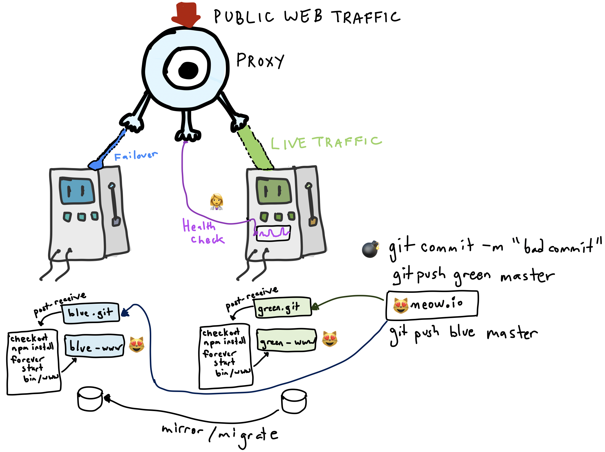

# Implement deployment strategy

Part 1. [Setup and Overview](README.md)  
Part 2. [Configure pipeline and infrastructure](Pipeline.md)  
Part 3. [Implement deployment strategy](Deploy.md) ⬅️  



## Settting up deployment strategy

Currently, we can deploy changes to our different VMs---however---we have nothing that regulates the control of traffic, nor logic which determines which `TARGET` is active. We will set up our infrastructure to fully handle a deployment, including automatic failover.

You may want to setup your terminals to help you distinguish your `GREEN` and `BLUE` environments, as follows:


### Task 1: Configure Proxy

We will be using our host environment coordinate our production environment with a proxy service. 

Complete the proxy service in `commands/serve.js` by adding a redirect from `localhost:3090` to our `TARGET` production endpoint.

```js
proxy.web( req, res, {target: self.TARGET } );
```

To activate, run `node index.js serve`. Visiting http://localhost:3090 should redirect you to the `GREEN` production environment.

### Task 2: Add automatic failover

In case a bad commit is pushed to our green environment, we want a way to automatically direct traffic back to our stable `BLUE` environment.

We will accomplish this by adding a health monitor, which checks every 5 seconds if the `GREEN` environment has any failure. If failure does occur, then it will automatically switch the `TARGET` to the `BLUE` environment.

Update the `healthCheck()` function to perform the switch.

##### Commit bad commit, trigger failover, revert bad change

We will introduce a bad commit to the `GREEN` environment which should trigger our failure over.

Modify the index route in meow.io, to explicitly fail: `res.status(500).render(...`. Then commit and push the change:

```
$ git add index.js
$ git commit -m "bad commit"
$ git push green master
```

You should observe your failover being triggered---traffic should now be served from the `BLUE` environment.

We can use this chance to patch production and revert our bad commit:
```
$ git revert HEAD
[master 5edde92] Revert "bad commit"
 1 file changed, 1 insertion(+), 1 deletion(-)

$ git push green master
```

Restart the `node index.js serve` process to restore traffic to the `GREEN` environment.

If you need to retrigger a commit, you can also use:

```bash
git commit --amend --no-edit
git push blue master -f
git push green master -f
```

### Task 3: Feature Flag

Notice that meow.io is not currently displaying any recent images. Set the value `RECENT=ON` inside the redis server on the `BLUE` environment.


You should be able to see the feature turned on:


A feature flag can be a powerful tool to assist with deployment. It can be used to fence off new features or quickly turn off buggy features without needing to rollback a commit.

### Task 4: Extra---Sync/migrate the database

Our infrastructure handles a lot now, but there is one detail missing. If a switch occurs while the `GREEN` environment received data, that data would be lost when switching back to the `BLUE` environment.

We have three possible strategies we can add to handle this which making the switch over.

**Strategy 1**: Copy database file.

This strategy will dump and then move over the whole sqlite database.
```bash
sqlite3 "/home/vagrant/green-www/data/meowio.db" ".backup /tmp/dbbackup.sqlite"
rsync vagrant@BLUE:"/tmp/dbbackup.sqlite" "/home/vagrant/blue-www/data/meowio.db"
```

While simple, the strategy might harm service availability and data durability, as the whole dataset must be copied before serving traffic, and there may be data corruption.

**Strategy 2**: Migrate missing rows table by table.

Missing rows can be appended to the `BLUE` database. This can be done before or after making switching. This strategy could effect consistency of the data.

**Strategy 3**: Mirror data.

Having the `GREEN` database mirror the data to the `BLUE` database allows the system to move data over during normal operation, and not during an emergency switch. Unfortunately, sqlite does not support mirroring, however, the code could be modified to mimic mirroring, or a real database system could be used instead.

